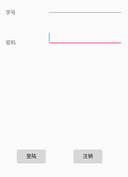

# Gdufe-Drcom-Android
广东财经大学Android版Drcom demo，哆点精简版，只提供登陆、退出测试功能。  
代码结构根据 [jlu-drcom-java](https://github.com/drcoms/jlu-drcom-client/tree/master/jlu-drcom-java) 改过来，做了广财的适配和安卓化。

## 常见问题
1. 使用前记得连上学校wifi
1. 关闭屏幕后断网了，去系统设置里给APP开锁屏清理白名单；默认在登陆后有通知栏提示，如果没有，也是系统设置没交保护费，自行设置去，通知栏的存在是为了[保活](http://www.jianshu.com/p/63aafe3c12af)，且方便用户看。
1. 广财版去掉了 `keep40_extra` 包的发送，不影响使用，其他学校看着办，一般也不用。
1. 已知 Bug
   1. 偶发性异常 `recvfrom failed: EAGAIN (Try again)`  可能为UDP丢包，目前解决方案是重发数据包。
   1. 偶发性异常 `sendto: Operation not Permitted` google说是Linux(android也是linux)底层的nf_conntrack模块的conntrack表满了，会自动drop掉网络包，可`iptables`或者调最大值解决，但Android没法在不root的情况下进行这些操作，很尴尬，所以目前也是重发。

## 适配广财
广财的包和其他学校的基本一样，看py版即可对比得知。
主要改了 [服务器地址、验证版本号](https://github.com/wintercoder/Gdufe-Drcom-Android/blob/master/app/src/main/java/com/guang/drcomandroid/drcom/DrcomConfig.java)、 [controlCheck、adapterNum、keepAliveVer、challenge()的第5个byte](https://github.com/wintercoder/Gdufe-Drcom-Android/blob/master/app/src/main/java/com/guang/drcomandroid/drcom/DrcomTask.java) 、[登陆包的AUTH_VERSION附近【第310个包，改动较大】](https://github.com/wintercoder/Gdufe-Drcom-Android/blob/master/app/src/main/java/com/guang/drcomandroid/drcom/DrcomTask.java)，其他基本不会被服务器校验，故没所谓。其中 `AUTH_VERSION` 附近代码与吉大的差异较大，且在客户端强制更新的时候会更新该字段，造成老版本不能用，故设为 `0x7f` 了，足够大。

## 适配其他学校
数据包为Drcom D版的数据，跟 [drcom-generic的py版](https://github.com/drcoms/drcom-generic/blob/master/custom/drcom_d_%E5%B9%BF%E4%B8%9C%E8%B4%A2%E7%BB%8F%E5%A4%A7%E5%AD%A6.py) 一样，不做mac地址、dns、dhcp服务器校验。若你校有固定网络中心的mac地址的请右转 [jlu-drcom-java](https://github.com/drcoms/jlu-drcom-client/tree/master/jlu-drcom-java)。  

否则修改 [DrcomConfig](https://github.com/wintercoder/Gdufe-Drcom-Android/blob/master/app/src/main/java/com/guang/drcomandroid/drcom/DrcomConfig.java) 的服务器地址、客户端版本号、dns、dhcp服务器基本就能用了

## 细节
ip地址从第一次 `challenge` 包的返回里 `[20:24]` 获取，不用手动输入，mac虽然不校验但还是获取设备的mac地址了，如果是android6.0以上会返回一个固定的mac地址。   
更多数据细节，如数据包各字节的意义，见 [吉大drcom的协议说明](https://github.com/drcoms/jlu-drcom-client/blob/master/jlu-drcom-java/jlu-drcom-protocol.md) ，吉大的跟多数学校（含广财）的D版不太一样，例子是吉大用的是py版 `mkpkt()` 里 `AUTH_VERSION` 上面被注释的几行而大多数学校用的是 `AUTH_VERSION` 那行。

## License
沿用 [jlu-drcom-java](https://github.com/drcoms/jlu-drcom-client/tree/master/jlu-drcom-java) 的 AGPL ，吃我一记 GPL 感染大法。  
若  [jlu-drcom-java](https://github.com/drcoms/jlu-drcom-client/tree/master/jlu-drcom-java)  修改了协议，欢迎通知，该仓库也跟着改。

